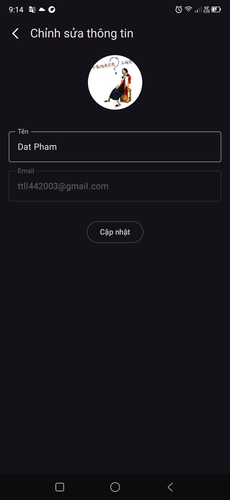

# CookGood

CookGood is an Android application built with Kotlin, designed to help users manage their cooking and recipes efficiently.

## Table of Contents

- [About](#about)
- [Features](#features)
- [Tech Stack](#tech-stack)
- [Screenshots](#screenshots)
- [Installation](#installation)
- [Usage](#usage)
- [Contributing](#contributing)
- [License](#license)
- [Contact](#contact)

## About

CookGood is an open-source Android app that provides an intuitive platform for storing, organizing, and discovering recipes. Users can securely sign in, capture photos, and enjoy a modern, responsive UI.

## Features

- User authentication with Firebase
- Add, edit, and delete recipes
- Organize recipes by category
- Capture and attach photos to recipes using CameraX
- Store data locally with Room database
- Display recipe images with Coil
- Built using Jetpack Compose for a modern UI
- Dependency injection with Dagger/Hilt
- Feature-base package

## Tech Stack

- **Language:** Kotlin
- **Framework:** Android
- **UI toolkit:** Jetpack Compose
- **Backend:** Firebase Authentication
- **Database:** Room
- **Image Loading:** Coil
- **Camera:** CameraX
- **Dependency Injection:** Dagger/Hilt

## Screenshots

| Login Screen                                | Recipe Detail Screen                                     | Add Recipe Screen                                      | Profile Screen                                   |
|---------------------------------------------|----------------------------------------------------------|--------------------------------------------------------|--------------------------------------------------|
|  |  |  |  |

## Installation

To build and run CookGood locally:

1. **Clone the repository:**
    ```bash
    git clone https://github.com/thecodinglife320/CookGood.git
    cd CookGood
    ```
2. **Open in Android Studio:**  
   Open the project with [Android Studio](https://developer.android.com/studio).

3. **Configure Firebase:**  
   - Create a Firebase project at [Firebase Console](https://console.firebase.google.com/).
   - Download the `google-services.json` file and place it in the `app/` directory.

4. **Build and Run:**  
   - Connect an Android device or start an emulator.
   - Click "Run" in Android Studio.

## Usage

- Sign in with your account.
- Add new recipes and capture photos using your device's camera.
- Organize and browse your recipes by category.
- Edit or delete recipes as needed.

## Contributing

Contributions are welcome! To contribute:

1. Fork the repository.
2. Create a new branch (`git checkout -b feature/YourFeature`).
3. Commit your changes (`git commit -am 'Add new feature'`).
4. Push to the branch (`git push origin feature/YourFeature`).
5. Open a Pull Request.

Please refer to the [CONTRIBUTING.md](CONTRIBUTING.md) file for more details if available.

## License

This project is licensed under the MIT License. See the [LICENSE](LICENSE) file for details.

## Contact

Project maintained by [thecodinglife320](https://github.com/thecodinglife320).
